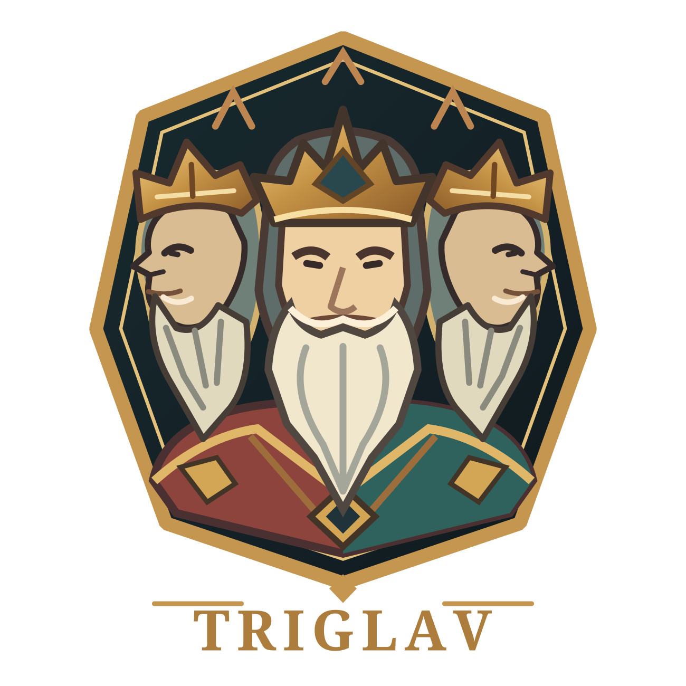
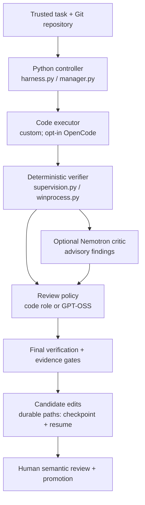

<p align="center">
  
</p>

<h1 align="center">TRIGLAV</h1>
<p align="center"><strong>Three Heads. One Verdict.</strong></p>
<p align="center">Local AI coding workflows with bounded edits, deterministic checks and human oversight.</p>

<p align="center">
  
  
  <a href="LICENSE"></a>
  
</p>

<p align="center">
  <a href="#overview">Overview</a> · <a href="#architecture">Architecture</a> ·
  <a href="#quick-start">Quick Start</a> · <a href="#verification">Verification</a> ·
  <a href="#safety">Safety</a> · <a href="#roadmap">Roadmap</a>
</p>

## Overview

TRIGLAV is a Python controller for local coding agents on **native Windows**.
It coordinates scoped edits, verification commands, model review and durable
recovery. Executor completion claims are untrusted; the controller owns the
evidence and acceptance gates. Humans review meaning, test suitability and promotion.

The default `custom` executor uses a bounded JSON action protocol. `run` handles
one supervised task; `long-run`, `resume` and `status` provide durable state.
`autonomous-run` and `autonomous-resume` expose a bounded ManagerLoop with
WorkUnit contracts, planning and scheduling.

**Snapshot boundary:** the SafeQwen worker and launcher are **not included**.
TQ-02R is historical external qualification evidence.
**Cloning this repository does not reproduce TQ-02R.** Its reported 32-test result
covers one bounded fixture, not production certification of this public snapshot.

## Architecture

The code executor proposes a candidate. Deterministic checks test it, review
policy adds model assessment, and final evidence gates control acceptance.
Failed gates lead to bounded retry or stop. Durable paths record checkpoints
for recovery; a checkpoint does not replace human semantic review.



| Component | Responsibility |
|---|---|
| Qwen / code executor | Proposes scoped edits; cannot authorize acceptance |
| Nemotron / critic | Supplies advisory findings when policy enables it |
| GPT-OSS / senior reviewer | Assesses code and verifier/critic evidence when required |
| Python controller | Enforces scope, budgets, lifecycle, verification and checkpoint gates |
| Human operator | Evaluates semantics, tests and promotion |

OpenCode is an opt-in external executor, with the retained integration pinned to
1.18.30. Cline is an external CLI for the retained WorkUnit adapter. Neither is the
default entry point; Aider comparisons are not a shipped runtime.
See [architecture](ARCHITECTURE.md) and [executor boundaries](OPENCODE_BOUNDARY.md).

## Quick Start

**Prerequisites:** native Windows, Python 3.11+, Git and PowerShell on PATH.
For model execution, provision a dedicated loopback llama-swap gateway, compatible
local model servers and model weights separately. Optional executor CLIs also
need separate installation. Review their licenses and RAM/VRAM requirements;
the historical large reviewer is resource intensive.

The controller uses the Python standard library. [requirements-dev.txt](requirements-dev.txt)
lists pytest for development; the offline CI checks below use unittest.
No dependency, gateway, binary, model or third-party CLI is installed automatically.

```powershell
git clone https://github.com/MilJav11/triglav-harness.git
cd triglav-harness
python -B harness.py --help
```

Help is offline. Before running a task:

1. Read [configuration and startup](RUNBOOK.md) and provision the external runtimes.
2. Adapt [config/llama-swap.yaml](config/llama-swap.yaml) and
   [config/harness.json](config/harness.json) to your executables, model files and
   reviewer expert files. Generic absolute defaults are examples, not portable discovery.
3. Prepare a disposable, clean target Git repository with an initial commit and
   trusted code/tests. Durable identity also requires a committed controller checkout.

**The following commands contact/start the gateway; smoke performs real inference.**
Run them only after provisioning and reviewing your configuration:

```powershell
.\scripts\start-swap.ps1
python harness.py health
python harness.py smoke --role code
python harness.py run --repo '.\target-repo' --task 'Fix the requested behavior' --verify 'python -m unittest discover -v'
```

Add `--reviewer` to the run command for senior review. Advisory `--critic` is a
global flag used with compatible reviewer policy. Repeat `--verify` for independent
checks. Candidate edits remain available for inspection; the controller does not
commit or push them. OpenCode is selected with `autonomous-run --executor opencode`;
its exit status cannot bypass controller verification or scope checks.

## Verification

Run the reviewed offline checks from a committed Windows checkout:

```powershell
python -B scripts/ci_offline.py
```

[Offline CI](docs/CI.md) parses all Python source, runs **8 executor-protocol,
14 planner-protocol and 10 guard tests**, and captures CLI help. Model replies are
mocked/scripted. Planner cases use disposable Git fixtures and the real Python
supervision broker; network/process/Gateway guards constrain the reviewed checks.
Controller identity uses actual Git HEAD, without the earlier export audit's shim.

CI runs on GitHub-hosted Windows with Python 3.11 for pull requests to main and
pushes to main. It has read-only contents permission, no repository secrets,
no persistent checkout credentials and a ten-minute timeout. This bounded scope
is not full test coverage. Do not run the entire suite or smoke scripts blindly:
retained tests include native process, local HTTP server and optional CLI cases.

[Public validation history](VALIDATION.md) describes earlier executed/skipped work.
Historical live qualification has not been rerun by these offline checks.
The Manager reporting discrepancy—**ALL_CRITERIA_PROVEN versus nested AC1–AC3
NOT_PROVEN**—remains disclosed in [qualification limits](docs/triglav/QUALIFICATION.md).
Model reviews and hashes do not establish semantic correctness.

## Safety

Use trusted repositories and tests: verification executes repository code.
Scope checks, closed protocols, CI guards and Windows process ownership are
**not an OS sandbox**. Use a dedicated gateway because unload affects its resident
models. Protect local configuration, logs and evidence.

Hostile-repository safety, concurrency, all crash windows, broad unattended
operation, long-horizon autonomy and universal resource bounds are not established.
No cross-platform or small-hardware qualification, production certification or
blanket autonomous-engineering safety guarantee is claimed.

Read [safety and limitations](docs/triglav/SAFETY_AND_LIMITATIONS.md),
[process supervision](PROCESS_SUPERVISION.md), [durable runs](DURABLE_RUNS.md)
and the [recovery protocol](CONVERGENCE.md).

## Roadmap

Portable SafeQwen integration, Aider evaluation, smaller reviewers, host isolation
and broader multi-project autonomy remain proposed work. No experimental terminal
banner is shipped. See the [roadmap](docs/triglav/ROADMAP.md) and
[public documentation](docs/triglav/README.md) for scope and evidence.

Eligible original software and associated documentation use the [MIT License](LICENSE),
copyright 2026 MilJav11. See [licensing and provenance](LICENSING.md).
The owner-approved independent logo remains under the separate [brand usage policy](BRAND_USAGE.md)
and [artwork provenance](docs/triglav/assets/README.md); the prior reference-derived
artwork is excluded.
