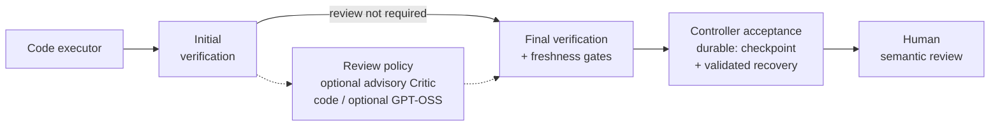

<p align="center">
  
</p>

<h1 align="center">TRIGLAV</h1>
<p align="center"><strong>Three Heads. One Verdict.</strong></p>
<p align="center">Local AI coding workflows with bounded edits, deterministic checks and human oversight.</p>

<p align="center">
  
  
  <a href="LICENSE"></a>
  
</p>

<p align="center">
  <a href="#overview">Overview</a> · <a href="#architecture">Architecture</a> ·
  <a href="#quick-start">Quick Start</a> · <a href="#verification">Verification</a> ·
  <a href="#safety">Safety</a> · <a href="#roadmap">Roadmap</a>
</p>

## Overview

TRIGLAV is a Python controller for local coding agents on **native Windows**.
It coordinates scoped edits, verification commands, model review and durable
recovery. Executor completion claims are untrusted; the controller owns the
evidence and acceptance gates. Humans review meaning, test suitability and promotion.

The default `custom` executor uses a bounded JSON action protocol. `run` handles
one supervised task; `long-run`, `resume` and `status` provide durable state.
`autonomous-run` and `autonomous-resume` expose a bounded ManagerLoop with
WorkUnit contracts, planning and scheduling.

**Verified Phase 8B source baseline:** public commit
`1a3167830f8d1fdf79dba255346784f57793a3ce` contains 111 tracked files and passed
**129/129 guarded offline CI tests**. The opt-in [SafeQwen integration](docs/SAFEQWEN.md)
includes a closed-tool worker, fixed-WorkUnit launcher and direct identity adapter.
**Phase 8B Stage 2 qualification completed successfully** on one bounded fixture:
Qwen execution, Nemotron findings, GPT-OSS approval, fresh final verification and
a validated trusted checkpoint. See the [qualification summary](docs/triglav/QUALIFICATION.md#phase-8b-stage-2).

**Clone readiness: PARTIAL.** Public source functionality and offline checks are
available; the qualified deployment additionally used private operator tooling
and locally provisioned model runtimes. A clean clone does not reproduce that
full chain or historical TQ-02R. This is not general autonomous coding or
production certification. The [documentation index](docs/triglav/README.md)
lists storage locations, Git exclusions and missing reproduction assets.

## Architecture

The code executor proposes a candidate. Deterministic checks test it, review
policy adds model assessment, and final evidence gates control acceptance.
Failed gates lead to bounded retry or stop. Durable paths record checkpoints
for recovery; a checkpoint does not replace human semantic review.



| Component | Responsibility |
|---|---|
| Qwen / code executor | Proposes scoped edits; cannot authorize acceptance |
| Nemotron / critic | Supplies advisory findings when policy enables it |
| GPT-OSS / senior reviewer | Assesses code and verifier/critic evidence when required |
| Python controller | Enforces scope, budgets, lifecycle, verification and checkpoint gates |
| Human operator | Evaluates semantics, tests and promotion |

OpenCode is an opt-in external executor, with the retained integration pinned to
1.18.30. Cline is an external CLI for the retained WorkUnit adapter. Neither is the
default entry point; Aider comparisons are not a shipped runtime.
See [architecture](ARCHITECTURE.md) and [executor boundaries](OPENCODE_BOUNDARY.md).

## Quick Start

This is a **source-only** start on native Windows with Python 3.11+, Git and
PowerShell on PATH. The controller uses the Python standard library;
[requirements-dev.txt](requirements-dev.txt) lists pytest for development, while
the guarded CI entry point uses unittest. No model or gateway is needed below.

```powershell
git clone https://github.com/MilJav11/triglav-harness.git
cd triglav-harness
python -B harness.py --help
python -B scripts/ci_offline.py
```

Help is offline. The reviewed CI command parses Python, checks CLI/dry-run
behavior and runs scripted model responses with disposable fixtures. It does
not install dependencies, start a gateway or run models. It executes trusted
fixture code and Git/Python subprocesses; use the committed checkout.

For a different workstation, use the [portable Windows setup baseline](docs/WINDOWS_SETUP.md)
for public dependency links, operator-local three-role examples and the exact
remaining HotPin resource-policy integration seam. Clone readiness remains PARTIAL.

For live use, first read the [runbook](RUNBOOK.md) and
[SafeQwen setup and limits](docs/SAFEQWEN.md). Provision compatible llama-swap,
model servers, weights and any optional executor CLIs separately, then adapt the
configuration examples. The supplied absolute defaults are installation examples,
not runtime discovery. The privately qualified tooling, deployment configuration
and frozen fixture are not a public reproduction package; see
[dependencies and missing integration assets](docs/triglav/README.md#dependencies-and-missing-integration-assets).

## Verification

Run the reviewed offline checks from a committed Windows checkout:

```powershell
python -B scripts/ci_offline.py
```

[Offline CI](docs/CI.md) parses all Python source, runs **8 executor-protocol,
14 planner-protocol and 10 guard tests**, plus **39 SafeQwen worker, 40 integration
and 8 selected final-verification/checkpoint regressions**, plus **10 milestone
verifier timeout regressions** (**129 total**), and captures CLI help. Model replies are
mocked/scripted. Planner cases use disposable Git fixtures and the real Python
supervision broker; network/process/Gateway guards constrain the reviewed checks.
Controller identity uses actual Git HEAD, without the earlier export audit's shim.

CI runs on GitHub-hosted Windows with Python 3.11 for pull requests to main and
pushes to main. It has read-only contents permission, no repository secrets,
no persistent checkout credentials and a ten-minute timeout. This bounded scope
is not full test coverage. Do not run the entire suite or smoke scripts blindly:
retained tests include native process, local HTTP server and optional CLI cases.

[Public validation history](VALIDATION.md) describes earlier executed/skipped work.
Offline CI does not rerun live qualification. The completed Phase 8B Stage 2
result is documented separately. The Manager reporting discrepancy remains:
**ALL_CRITERIA_PROVEN versus nested AC1 NOT_PROVEN / completion null** in Stage 2
(and AC1–AC3 in historical TQ-02R). See [qualification limits](docs/triglav/QUALIFICATION.md#reporting-discrepancy).
Model reviews and hashes do not establish semantic correctness.

## Safety

Use trusted repositories and tests: verification executes repository code.
Scope checks, closed protocols, CI guards and Windows process ownership are
**not an OS sandbox**. Use a dedicated gateway because unload affects its resident
models. Protect local configuration, logs and evidence.

Hostile-repository safety, concurrency, all crash windows, broad unattended
operation, long-horizon autonomy and universal resource bounds are not established.
No cross-platform or small-hardware qualification, production certification or
blanket autonomous-engineering safety guarantee is claimed.

Read [safety and limitations](docs/triglav/SAFETY_AND_LIMITATIONS.md),
[process supervision](PROCESS_SUPERVISION.md), [durable runs](DURABLE_RUNS.md)
and the [recovery protocol](CONVERGENCE.md).

## Roadmap

Phase 8B Stage 2 is complete for one privately provisioned bounded fixture.
Public deployment reproducibility, Aider evaluation, smaller reviewers, host
isolation and broader multi-project autonomy remain proposed work. No experimental terminal
banner is shipped. See the [roadmap](docs/triglav/ROADMAP.md) and
[public documentation](docs/triglav/README.md) for scope and evidence.

Eligible original software and associated documentation use the [MIT License](LICENSE),
copyright 2026 MilJav11. See [licensing and provenance](LICENSING.md).
The owner-approved independent logo remains under the separate [brand usage policy](BRAND_USAGE.md)
and [artwork provenance](docs/triglav/assets/README.md); the prior reference-derived
artwork is excluded.
