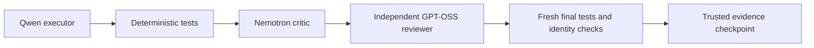

<p align="center">
  
</p>

<h1 align="center">TRIGLAV</h1>
<p align="center"><strong>Three Heads. One Verdict.</strong></p>
<p align="center">Local AI coding workflows with bounded edits, deterministic checks and human oversight.</p>

<p align="center">
  
  
  <a href="LICENSE"></a>
  
  <a href="https://github.com/MilJav11/triglav-harness/actions/workflows/offline-ci.yml"></a>
</p>

<p align="center">
  <a href="#overview">Overview</a> · <a href="#architecture">Architecture</a> ·
  <a href="#quick-start">Quick Start</a> · <a href="#verification">Verification</a> ·
  <a href="#safety">Safety</a> · <a href="#roadmap">Roadmap</a>
</p>

## Overview

TRIGLAV is an experimental local coding harness for native Windows, inspired by
AMAP-ML/LongHorizon-Harness: bounded work, deterministic verification, recorded
evidence and recovery/checkpoint gates. Models propose changes; the Python
controller decides whether the evidence permits acceptance.

## Architecture

The simplest path uses the included SafeQwen worker for one operator-scoped task.
It can swap compatible local models through configuration. The optional full path
adds an advisory critic and a distinct independent reviewer:


```mermaid
flowchart LR
    E[Qwen executor] --> V[Deterministic tests]
    V --> C[Nemotron critic]
    C --> R[Independent GPT-OSS reviewer]
    R --> F[Fresh final tests and identity checks]
    F --> T[Trusted evidence checkpoint]
```

Code-only execution ends at an intermediate `READY / MILESTONE_READY` result;
it does **not** create a trusted checkpoint. Model approval cannot override a
failed test, scope, ownership or checkpoint gate. The existing custom executor,
Manager/WorkUnit routes and optional adapters remain available; see
[architecture](ARCHITECTURE.md) and [SafeQwen authority](docs/SAFEQWEN.md).

## Quick Start

Use native Windows, **x64 Python 3.11+**, Git and PowerShell. Python 3.11 is the
Windows CI baseline. The controller and guarded tests use the standard library;
no pip install, models, Gateway, OpenCode or Cline are required for offline checks.

```powershell
git clone https://github.com/MilJav11/triglav-harness.git
cd triglav-harness
python -B scripts/ci_offline.py
```

Expected: exit **0**, `PASS: 209 reviewed offline cases; CLI help; ...; model calls 0`.
The runner uses scripted responses, trusted disposable Git fixtures and real
Windows supervision; this is not a live-model test. The release changes described
here must first be committed/published: the existing remote revision does not
contain an uncommitted local working tree.

### Local Qwen calculator demo

The [public calculator fixture](examples/calculator/README.md) contains four
passing addition tests and six intentionally failing multiplication tests.
Create a **new** disposable Git target from those files; keep its tests frozen.
The [Windows demo recipe](docs/WINDOWS_SETUP.md#local-qwen-demo) gives exact
fixture creation, configurable runtime setup, dedicated Gateway/PID ownership
and shutdown steps. Separately provision compatible llama-swap, llama-server and
Qwen3-Coder-30B-A3B GGUF files; no model/runtime binary is bundled or downloaded by
this repository. No HotPin asset is needed for the basic demo.

After following that setup, from the controller root:

```powershell
python -B harness.py --config config/safeqwen.local.json autonomous-run `
  --executor safe_qwen --safeqwen-policy config/safeqwen-policy.local.json `
  --repo ../disposable-calculator --task "Implement multiply in calculator.py" `
  --verify "python -m unittest test_calculator.py" `
  --acceptance "All ten frozen tests pass; only calculator.py changes" `
  --allow calculator.py --forbid test_calculator.py --dry-run --quiet
```

Require dry-run exit **0** and `models_contacted: false`. Then run that command
**once**, removing only `--dry-run`, to invoke the local Qwen model. Successful
code-only coding normally returns exit **2**, `READY / MILESTONE_READY`, and
**10/10 tests passing**, with only `calculator.py` changed. Inspect the actual
run evidence and independently run the frozen tests. Exit 2 is not a trusted
checkpoint. Preserve failed attempts; do not silently rerun or reset the fixture.

### Optional three-model qualification

The [advanced recipe](docs/WINDOWS_SETUP.md#optional-three-model-workflow) reuses
the existing Qwen -> Nemotron -> GPT-OSS route, explicit reviewer policy and
owned-process checks. It requires separately provisioned compatible runtimes,
all GPT-OSS shards and an operator-approved expert asset/digest. Review requires
**44 GiB available RAM** and **32 GiB hard process working-set readback before
inference**, including cached-role reuse. These are not total RAM/VRAM or loading
memory guarantees. Optional HotPin work does not block the code-only demo.

## Verification

On 10 October 2026, Public Run 003 executed real Qwen (3 calls), Nemotron (1 call,
`CRITIC_FINDINGS`, one advisory finding) and GPT-OSS (1 call, `APPROVE`). All ten
frozen tests and fresh final verification passed; a trusted evidence checkpoint
was independently validated and owned-process cleanup passed. This was one
bounded WorkUnit on one operator-provisioned host, not a portable binary bundle.
See the [sanitized qualification summary](docs/triglav/QUALIFICATION.md#public-run-003).

The current guarded scope is **209 offline cases**, including policy/identity,
native fake-handle, cached/TTL and final-checkpoint regressions. See
[CI scope](docs/CI.md). Offline success never proves live behavior. Do not run
all retained smoke scripts blindly; some intentionally invoke live models or
external CLIs.

## Safety

Use trusted repositories and frozen tests: verification executes candidate code.
Scope and process-ownership checks are **not an OS sandbox**. Use a dedicated
loopback Gateway and keep model assets, credentials, local configurations, PID
files, logs and raw evidence outside publication. Runtime commands and model
paths are operator-configurable; templates use fictional paths.

Unverified: sustained multi-step long-horizon execution, live recovery/resume and
TTL reload, adversarial repositories, concurrent host mutations, cross-machine
runtime compatibility and general semantic correctness. WorkUnit checkpoints
and legacy Manager criteria reporting are distinct; see
[qualification limits](docs/triglav/QUALIFICATION.md#reporting-discrepancy).
No private Stage 2 watchdog, broker or evidence package is required by the public
SafeQwen demo. Licensed models, native binaries and host capacity remain external
prerequisites. Read [setup](docs/WINDOWS_SETUP.md), [runbook](RUNBOOK.md),
[recovery](CONVERGENCE.md) and [limitations](docs/triglav/SAFETY_AND_LIMITATIONS.md).

## Roadmap

The next product milestone is **PUBLIC GITHUB READINESS**: reproducible offline
checks, a bounded local demo and clear configuration. Further optimization is
deferred. One-work-unit qualification does not establish general autonomy.

Eligible original software/documentation use the [MIT License](LICENSE),
copyright 2026 MilJav11; see [licensing](LICENSING.md). The independent logo has
its separate [brand usage policy](BRAND_USAGE.md) and
[artwork provenance](docs/triglav/assets/README.md).
