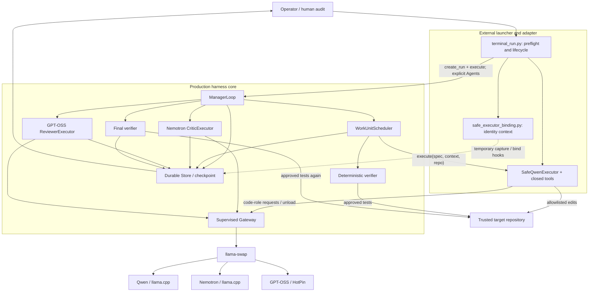
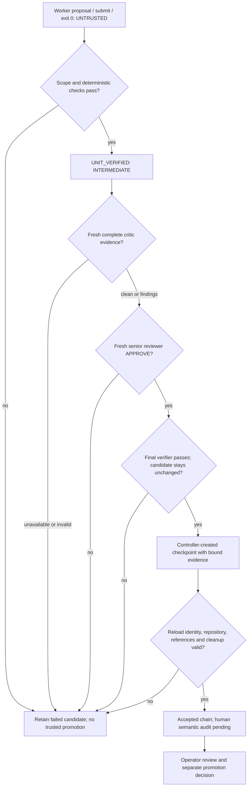

# TRIGLAV architecture

PUBLIC PREVIEW — Phase 4 AS-IS baseline, 9 October 2026. Production HEAD: `c96e4a3565cb3e67df67de9b89c49753e4b34791`. Claim IDs resolve in the [public evidence summary](EVIDENCE_SUMMARY.md#claim-map).

## Component responsibilities

| Component | Code boundary and responsibility |
|---|---|
| Production core | `manager.py`: ManagerLoop and lifecycle decisions; `work_units.py`: immutable contracts and intermediate results; `work_unit_scheduler.py`: ordered dependencies, attempt limits, scope checks and deterministic verification |
| External terminal launcher | `terminal_run.py`: validate configuration, pins, clean target, resources and ownership; construct one controller-authored WorkUnit; inject worker; retain evidence; validate completed reload/reuse and final cleanup |
| External SafeQwenExecutor | `integration_shim.py`: supervised Gateway binding, strict response envelope, request diagnostics, worker deadline and unload; `safe_qwen_worker.py`: policy and tool conversation; `tool_protocol.py`: closed JSON contract |
| External identity adapter | `safe_executor_binding.py`: fingerprint worker/protocol/transport/binding/launcher and policy; temporarily extend environment capture and executor binding in memory |
| Local runtime | `harness.py` Gateway plus existing swap configuration/scripts: lifecycle and RAM guards; llama-swap owns model processes |
| Deterministic verifier | Scheduler runs operator-approved verifier IDs through DurableRepository/Supervisor; test outcome is independent of worker submission |
| Nemotron critic | `critic_executor.py`: structured advisory findings bound to the candidate packet; cannot authorize a checkpoint |
| GPT-OSS reviewer | `reviewer_executor.py`: senior arbitration; approval remains subject to final deterministic verification and freshness |
| Final verifier | `execute_final_verification`: re-execute required verifier IDs after approval; reject mutations and stale review/candidate evidence |
| Store/checkpoints | `durable.py`: flushed event ledger, atomic state cache, artifact references and validation; reviewer checkpoint helper binds milestone evidence |
| Operator | Choose trusted fixture/tests, inspect semantic correctness, resolve ambiguous ownership, and authorize promotion/publication |

[A01–A08, S01–S04](EVIDENCE_SUMMARY.md#claim-map)



The diagram distinguishes code ownership, not OS security isolation. Role edges represent sequential model use, not three simultaneous resident agents. [A01–A06](EVIDENCE_SUMMARY.md#claim-map)

## Exact qualified entry into ManagerLoop

For qualification, `terminal_run.execute_production` surrounds creation, execution and reload/reuse with `identity_binding()`. `_execute_production` loads production modules from the pinned harness path, constructs the worker and effective config, then calls:

1. `manager.create_run(..., work_units=[spec], verifier_registry=registry, executor=worker)`, with critic/reviewer enabled, `review_policy='three-model'`, one round and zero step retries.
2. A factory binds the worker to the supplied supervised Gateway and returns `Agents(None, worker, None, None)`.
3. `manager.execute(..., agents=agents_factory, gateway=gw)` creates a Supervisor and ScopedRepository, binds/checks the executor and environment, then calls `ManagerLoop.run()`.
4. Because state contains WorkUnits, `run()` dispatches `run_work_units()` to the existing scheduler; the scheduler invokes `agents.executor.execute(spec, context, repo)`.

No live model planner decomposes these qualification tasks. The launcher supplies one fixed `terminal-task` contract with no dependencies. The scheduler ignores the executor return value for acceptance; exceptions, actual filesystem state and its own verifier determine the attempt outcome. The launcher separately requires a successful durable worker receipt. [A01–A03](EVIDENCE_SUMMARY.md#claim-map)

The production legacy CLI creates the step-based custom/OpenCode route. It has its own planning, budgets and policies; its name and flags do not imply SafeQwen WorkUnit execution. The current in-tree config still selects `custom`; the launcher sets `safe_qwen` only in a copied effective config. [A01, S03](EVIDENCE_SUMMARY.md#claim-map)

## Qualified execution sequence

```mermaid
sequenceDiagram
  participant H as Operator
  participant L as External launcher
  participant M as Production Manager / Scheduler
  participant E as SafeQwenExecutor
  participant G as Gateway / llama-swap
  participant V as Controller verifier
  participant C as Nemotron critic
  participant R as GPT-OSS reviewer
  participant D as Store
  H->>L: Reviewed contract and fresh run ID
  L->>L: Preflight pins, clean baseline, resources, ownership
  L->>G: Start owned gateway with review-safe profile
  L->>M: create_run + execute with injected WorkUnit executor
  M->>E: execute bounded unit
  E->>G: Load Qwen; strict JSON conversation
  E->>E: read_files / exact edit_file / submit
  E->>G: Unload; verify cleanup
  E->>D: Persist untrusted receipt and diagnostics
  M->>M: Scope and candidate checks
  M->>V: Approved frozen verifier
  V-->>M: Pass / failure evidence
  M->>D: UNIT_VERIFIED, INTERMEDIATE
  M->>C: Fresh complete candidate packet
  C->>G: Nemotron request then unload
  C-->>M: Advisory result
  M->>R: Candidate, verifier and critic evidence
  R->>G: GPT-OSS request then unload
  R-->>M: APPROVE or non-approval
  M->>V: Final verifier after APPROVE
  V-->>M: Tests and filesystem stability
  M->>D: Bound trusted checkpoint if gates pass
  M-->>L: Completed result and cleanup status
  L->>D: Fresh load, executor binding, reference validation
  L->>M: Two unchanged reuse calls; no new work expected
  L->>G: Ownership-checked shutdown
  L-->>H: CHAIN_ACCEPTED_AWAITING_HUMAN_AUDIT
```

This is the successful qualification route. Verification failure stops before critic/reviewer/final/checkpoint, as TQ-02 demonstrates. Non-approval, incomplete candidate evidence, drift, timeout or cleanup problems require a non-accepted outcome or human investigation. The WorkUnit branch does not demonstrate a general automatic multi-round repair campaign. [Q02, A03–A07, L02–L04](EVIDENCE_SUMMARY.md#claim-map)

## Trust and verification flow



Nemotron findings are advisory even when the qualification chain requires a completed critic stage. GPT-OSS cannot override a failing deterministic verifier. A checkpoint is controller acceptance under the configured checks, not a Git commit, signature or semantic proof. [A04–A08](EVIDENCE_SUMMARY.md#claim-map)

## Fingerprints, persistence and reuse

The external binding verifies the actual SafeQwenExecutor type, exact tool inventory, scope, limits, request settings and five source hashes. It adds `safe_qwen:*` runtime identities and a policy identity to the existing environment capture, and checks the actual worker against the pinned identity before binding. Existing environment/candidate/review/final/checkpoint digests carry that identity. Hooks are restored on exit. They are process-global during the context and assume one controller per interpreter. A bare production reload without the adapter cannot reconstruct the safe runtime entries and refuses reuse. [S03](EVIDENCE_SUMMARY.md#claim-map)

Store flushes a hash-linked JSONL write-ahead ledger as the commit point, then replaces `state.json` atomically as a cache. An RLock and deep copies limit aliasing inside a process. Artifact references hash canonical JSON payloads; files also contain a trailing newline, so raw file SHA-256 is a different value. Store loading checks ledger/state/reference consistency. It is not an independent attestation service. [A08](EVIDENCE_SUMMARY.md#claim-map)

Completed WorkUnit reuse additionally compares environment, repository, WorkUnits, critic/reviewer bindings and final filesystem digest, then checks unload/idle state. Loading a Store alone does not establish present fixture freshness. The recorded two unchanged reuse checks reuse acceptance evidence; they are not two fresh test suites or new model runs. [A07, Q04](EVIDENCE_SUMMARY.md#claim-map)

## Reporting and cleanup caveats

The WorkUnit branch creates its milestone checkpoint and concludes `ALL_CRITERIA_PROVEN` without calling the legacy `check_completion()` path that populates `proven_checks`. `write_report()` still derives nested criteria from those legacy fields. TQ-02R therefore retains `NOT_PROVEN`, `completion=null`, zero `rounds_started`/`trusted_rounds`, and empty legacy `model_invocations`. One WorkUnit attempt and three code completion requests are independently recorded. This is a source-backed reporting-path explanation, not a reconciliation or a repair. [L02](EVIDENCE_SUMMARY.md#claim-map)

`conclude()` records unload failure but can still commit the requested status. The checkpoint helper writes `cleanup_passed=true` without itself observing cleanup. Accordingly, the external launcher checks Manager cleanup, supervisor health/idle state and final gateway shutdown separately. Checkpoint cleanup metadata alone is insufficient. [L03](EVIDENCE_SUMMARY.md#claim-map)

Configuration names also do not determine effective request deadlines: the reviewer Gateway uses the general 900-second request timeout, clipped by the current execution deadline; the nested reviewer value of 300 seconds is not the selected timeout in `Gateway.chat`. The WorkUnit and final verifier timeout paths differ. See the [public operational limits summary](EVIDENCE_SUMMARY.md#operational-limits) for the qualified contract limits. [L04](EVIDENCE_SUMMARY.md#claim-map)
